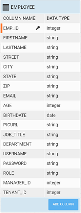
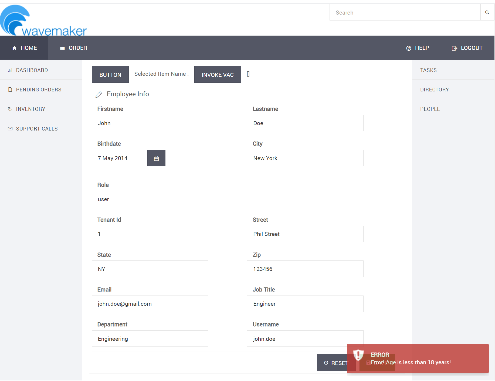
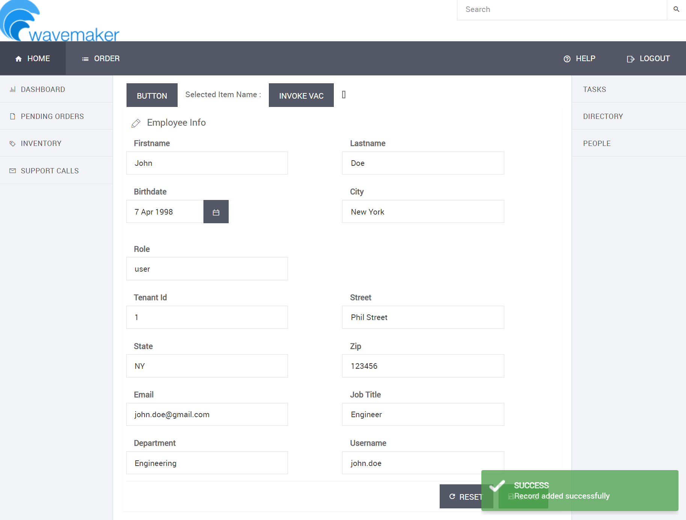

## Overview

WaveMaker's runtime framework publishes **pre** and **post** events for every database CRUD operation, letting you inject custom logic at the Java layer without modifying your UI code. This guide shows you how to implement a **pre-create event listener** on the `Employee` entity that calculates age from a birthdate and rejects any record where the employee is under 18 years old.

---

## Prerequisites

Before you begin, make sure you have:

- The **HRDB** sample database imported and configured in your WaveMaker project
- The **Employee** table updated with a new integer column named `Age`



---

## Step 1 — Create the Java Service

1. In WaveMaker Studio, navigate to **File Explorer → Java Services** and click **+ New Java Service**.
2. Name the service `AgeCalculator` and set the package to `com.employeeproject.agecalculator`.
3. Replace the generated class body with the implementation below:

```java
package com.employeeproject.agecalculator;

import java.sql.Date;
import java.time.Period;
import java.time.LocalDate;

import org.slf4j.Logger;
import org.slf4j.LoggerFactory;

import com.wavemaker.runtime.service.annotations.ExposeToClient;
import org.springframework.context.event.EventListener;

import com.employeeproject.employeedb.Employee;

import com.wavemaker.commons.WMRuntimeException;
import com.wavemaker.runtime.data.event.EntityPreCreateEvent;
import com.wavemaker.commons.MessageResource;

@ExposeToClient
public class AgeCalculator {

    private static final Logger logger = LoggerFactory.getLogger(AgeCalculator.class);

    @EventListener
    public void beforeEmployeeCreate(EntityPreCreateEvent<Employee> entityPreCreateEvent) {
        Employee employee = entityPreCreateEvent.getEntity();

        final Date sqlDate = employee.getBirthdate();
        logger.info("Inside [EntityPreCreateEvent], birthdate {}", sqlDate);

        Period period = Period.between(sqlDate.toLocalDate(), LocalDate.now());
        logger.info("Current Age : {}", period.getYears());

        if (period.getYears() < 18) {
            throw new WMRuntimeException(
                MessageResource.create("Error! Age is less than 18 years!")
            );
        } else {
            employee.setAge(period.getYears());
        }
    }
}
```

:::note
The `@EventListener` annotation registers `beforeEmployeeCreate` with Spring's event system. WaveMaker fires `EntityPreCreateEvent<Employee>` automatically before any new `Employee` row is inserted — no additional wiring is required.
:::

4. Save the file. WaveMaker compiles the service and registers it in the application context.

---

## Step 2 — Set Up the Live Form

1. Open the page where you want employees to be created.
2. From the **Widgets** panel, drag a **Live Form** widget onto the canvas.
3. In the **Properties** panel, bind the Live Form's **dataset** to the **Employee CRUD variable**.
4. Ensure the **Birthdate** field is included in the form and mapped to the correct date-type column.
5. Save the page.

{/* TODO: Add screenshot — Live Form bound to Employee CRUD variable with Birthdate field visible */}

---

## Step 3 — Preview and Test

Run the application and navigate to the page with the Live Form.

### Scenario 1 — Employee under 18

1. Enter a birthdate that results in an age below 18 years.
2. Submit the form.
3. Verify the error message is displayed: **"Error! Age is less than 18 years!"**
4. Confirm no record was inserted in the Employee table.



### Scenario 2 — Employee 18 or older

1. Enter a valid birthdate for an employee who is at least 18 years old.
2. Submit the form.
3. Verify the record is created successfully and the **Age** column is automatically populated with the calculated value.



:::tip
Check the WaveMaker application logs to see the `logger.info` output from the event listener — useful for debugging birthdate parsing issues during development.
:::

---
