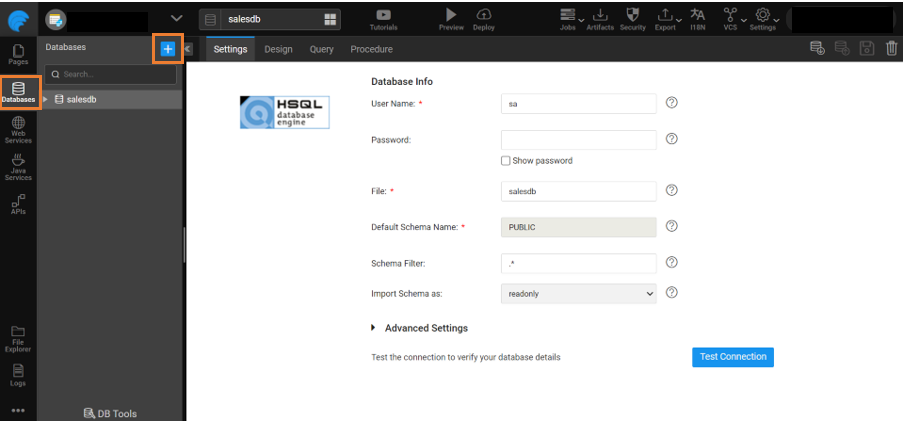
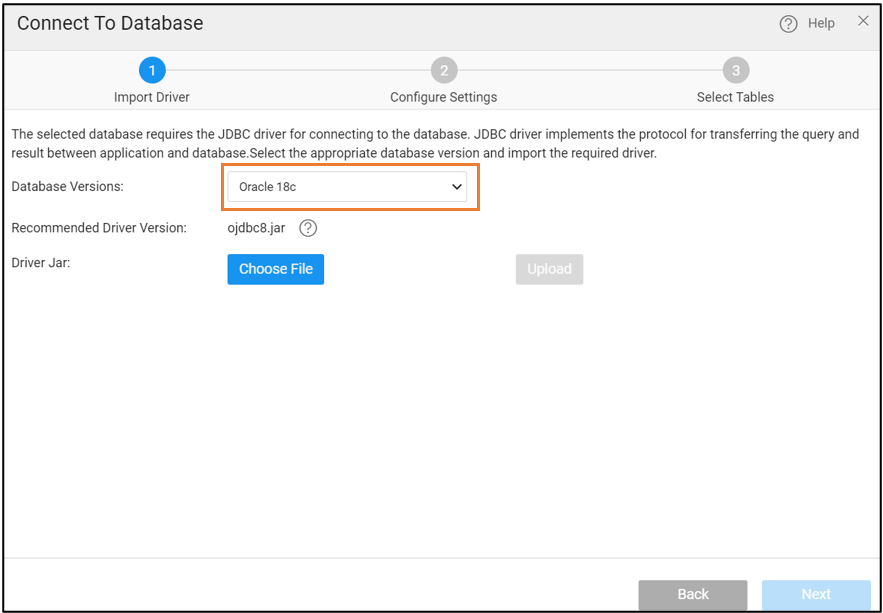

## Overview

JDBC (Java Database Connectivity) drivers enable WaveMaker to connect to and interact with external databases such as MySQL, Oracle, Microsoft SQL Server, and DB2. Each database requires its own driver, which provides the classes and methods needed for communication. This guide walks you through uploading the correct JDBC driver in WaveMaker Studio so you can establish a database connection.

---

## Prerequisites

Before you begin, make sure you have:

- Downloaded the recommended `.jar` file for your target database (see [Recommended JDBC Driver Versions](#recommended-jdbc-driver-versions) below)
- Verified that the `.jar` file is compatible with **Java 17 or Java 21**

---

## Recommended JDBC Driver Versions

The following tables list recommended JDBC driver versions for supported database integrations in WaveMaker Studio.

:::note
The download links for JDBC drivers redirect to external vendor pages. Always download and use a Java 17 or Java 21 compatible `.jar` file.
:::

### Oracle

| Oracle Database Version | Recommended Driver |
|---|---|
| Oracle 19c | ojdbc8.jar |
| Oracle 23c | ojdbc11.jar |

### DB2

| DB2 Database Version | Recommended Driver |
|---|---|
| v11.5 | db2jcc4.jar |

:::important
- Download the driver package from the official vendor site.
- Extract the downloaded archive if necessary.
- Use only the `.jar` file when uploading in WaveMaker Studio.
:::

---

## Upload the JDBC Driver

Follow these steps to upload a JDBC driver in WaveMaker Studio (example: Oracle database):

1. Navigate to the **Databases** section.
2. Click the **+** (Add New Database) option.

3. Select **Connect to a DB**.
4. Choose your target database type (for example, **Oracle Database**).
5. In the **Import Driver** window:
   - Select a suitable JDBC driver version.
   - Upload the corresponding `.jar` file from your local machine.
6. Click **Next** to proceed with the database configuration.

