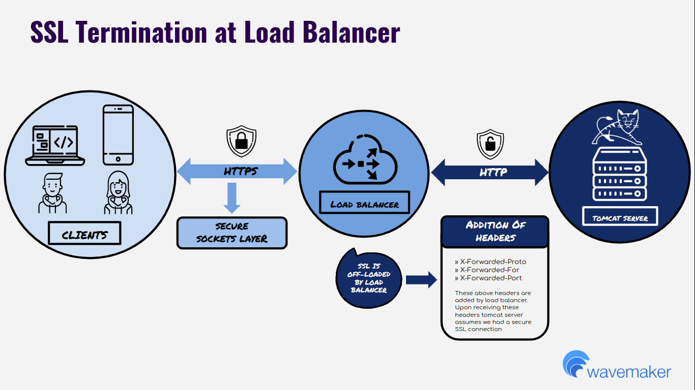

## Overview

SSL Termination (also called SSL offloading) is the process of removing SSL-based encryption from incoming HTTPS traffic at the LoadBalancer before forwarding it to your backend Tomcat server. This relieves the application server from the overhead of decryption and certificate management. This guide walks you through configuring Tomcat's `RemoteIpValve` so your WaveMaker app correctly identifies forwarded HTTPS traffic and responds with secure redirects, cookies, and URLs.

---

## Prerequisites

Before you begin, make sure you have:

- A WaveMaker app deployed and running on a Tomcat server
- A LoadBalancer in front of Tomcat, configured to:
  - Terminate SSL and forward plain HTTP to Tomcat
  - Add `X-Forwarded-Proto`, `X-Forwarded-For`, and `X-Forwarded-Port` headers to every forwarded request
- Root or sudo access to the Tomcat server to edit `server.xml`
- Access to WaveMaker Studio (required only for the optional header test in the last section)

---

## How SSL Termination Works

In a standard SSL-terminated setup, HTTPS traffic never reaches Tomcat directly. Instead:

1. Clients send HTTPS requests to the LoadBalancer.

2. The LoadBalancer handles the SSL handshake via the Secure Sockets Layer, decrypts the traffic, and forwards plain HTTP to the Tomcat server.

3. Before forwarding, the LoadBalancer injects the following headers so Tomcat can reconstruct the original request context:

   | Header              | Value             |
   | ------------------- | ----------------- |
   | `X-Forwarded-Proto` | `https`           |
   | `X-Forwarded-For`   | Client IP address |
   | `X-Forwarded-Port`  | `443`             |

4. Tomcat receives HTTP traffic and passes the request — with those headers — to your WaveMaker app.



Your WaveMaker app calls `request.isSecure()` to determine whether a request was made over HTTPS. Without additional configuration, Tomcat ignores the `X-Forwarded-*` headers, so `request.isSecure()` returns `false` for every request — even those that originated as HTTPS. This breaks secure cookie flags, HTTPS redirects, and any other behavior gated on `isSecure()`.

Configuring the `RemoteIpValve` instructs Tomcat to read and trust those headers, making `request.isSecure()` return `true` for HTTPS traffic forwarded through the LoadBalancer.

---

## Configure the Tomcat RemoteIpValve

1. SSH into your Tomcat server.
2. Open `server.xml`. The default path is `/usr/local/tomcat/conf/server.xml`.
3. Find the `<Host>` block that contains your existing `<Valve>` entry.
4. Insert the following snippet **above** the existing `<Valve>` tag:

```xml
<Valve className="org.apache.catalina.valves.RemoteIpValve"
  remoteIpHeader="X-Forwarded-For"
  requestAttributesEnabled="true"
  protocolHeader="X-Forwarded-Proto"
  protocolHeaderHttpsValue="https"
  portHeader="X-Forwarded-Port" />
```

5. Save the file.
6. Restart Tomcat to apply the change.

:::note
`protocolHeader` is only honored when the request originates from an IP range matching `internalProxies`. The built-in default covers standard RFC 1918 private ranges. If your LoadBalancer IP falls outside those ranges, follow the next section before restarting.
:::

---

## Configure Custom Internal Proxy IP Ranges (Optional)

By default, Tomcat only trusts `X-Forwarded-Proto` from requests originating within these IP ranges:

```
10.x.x.x | 192.168.x.x | 169.254.x.x | 127.x.x.x | 172.16–31.x.x | ::1
```

If your LoadBalancer sits outside these ranges, Tomcat silently ignores the header and `request.isSecure()` keeps returning `false`.

The full default regex value for `internalProxies` is:

```
10\.\d{1,3}\.\d{1,3}\.\d{1,3}|192\.168\.\d{1,3}\.\d{1,3}|169\.254\.\d{1,3}\.\d{1,3}|127\.\d{1,3}\.\d{1,3}\.\d{1,3}|172\.1[6-9]{1}\.\d{1,3}\.\d{1,3}|172\.2[0-9]{1}\.\d{1,3}\.\d{1,3}|172\.3[0-1]{1}\.\d{1,3}\.\d{1,3}|0:0:0:0:0:0:0:1|::1
```

To add your LoadBalancer's IP range:

1. Identify the IP range or specific IP of your LoadBalancer.
2. Append it to the default regex using `|` as a separator.
3. Set the combined value as the `internalProxies` attribute in the valve:

```xml
<Valve className="org.apache.catalina.valves.RemoteIpValve"
  internalProxies="10\.\d{1,3}\.\d{1,3}\.\d{1,3}|<your-lb-ip-range-regex>"
  remoteIpHeader="X-Forwarded-For"
  requestAttributesEnabled="true"
  protocolHeader="X-Forwarded-Proto"
  protocolHeaderHttpsValue="https"
  portHeader="X-Forwarded-Port" />
```

4. Save `server.xml` and restart Tomcat.

:::tip
To match a specific IP like `203.0.113.45`, use the regex `203\.0\.113\.45`. For a CIDR like `203.0.113.0/24`, use `203\.0\.113\.\d{1,3}`.
:::

---

## Test the Header Configuration

Use a temporary JSP page to verify that Tomcat is reading the forwarded headers correctly and that `request.isSecure()` returns `true`.

:::warning
Delete this file immediately after testing. Leaving it on the server leaks internal request header information and is a security risk.
:::

1. Create a file named `header_test.jsp` with the following content:

```jsp
<%@ page import="java.util.*" %>
<html>
  <head><title>EchoHeaders</title></head>
  <body>
    <h1>HTTP Request Headers Received</h1>
    <h2>Is Secure  : <%= request.isSecure() %></h2>
    <h2>Request URL: <%= request.getRequestURL() %></h2>
    <h2>Request URI: <%= request.getRequestURI() %></h2>
    <h2>Server Name: <%= request.getServerName() %></h2>
    <h2>Server Port: <%= request.getServerPort() %></h2>
    <h2>Remote Addr: <%= request.getRemoteAddr() %></h2>
    <table border="1" cellpadding="4" cellspacing="0">
    <%
      Enumeration eNames = request.getHeaderNames();
      while (eNames.hasMoreElements()) {
        String name = (String) eNames.nextElement();
        String value = normalize(request.getHeader(name));
    %>
      <tr><td><%= name %></td><td><%= value %></td></tr>
    <%
      }
    %>
    </table>
  </body>
</html>
<%!
  private String normalize(String value) {
    StringBuffer sb = new StringBuffer();
    for (int i = 0; i < value.length(); i++) {
      char c = value.charAt(i);
      sb.append(c);
      if (c == ';') sb.append(" ");
    }
    return sb.toString();
  }
%>
```

2. In WaveMaker Studio, upload `header_test.jsp` to the `src/main/webapp/resources` directory using the Studio Upload File UI.
3. Access the test page from a browser through the LoadBalancer (not directly via Tomcat):
   ```
   https://<your-app-domain>/<app-name>/resources/header_test.jsp
   ```
4. Verify the following in the output:
   - **Is Secure** shows `true`
   - `x-forwarded-proto` header shows `https`
   - `x-forwarded-for` header shows the client IP
5. Delete `header_test.jsp` from the server immediately after verification.

---

## Troubleshooting

### `request.isSecure()` still returns `false` after restarting Tomcat

Check each of the following in order:

| Symptom                                                                           | Likely cause                                                                      | Fix                                                                                        |
| --------------------------------------------------------------------------------- | --------------------------------------------------------------------------------- | ------------------------------------------------------------------------------------------ |
| `x-forwarded-proto` header missing from test page output                          | LoadBalancer is not injecting headers                                             | Configure header injection on the LoadBalancer side                                        |
| `x-forwarded-proto` is present but `Is Secure` is still `false`                   | LoadBalancer IP is outside `internalProxies` range                                | Add the LoadBalancer IP to `internalProxies` as described above                            |
| Headers present, `Is Secure` is `true` in the test page, but app still misbehaves | App-level cache or redirect loop                                                  | Clear browser cache; check for HTTP → HTTPS redirect misconfiguration in the app           |
| Tomcat did not pick up the change                                                 | `server.xml` edit was applied to the wrong file or Tomcat was not fully restarted | Confirm the valve is in the correct `<Host>` block and run a full stop/start, not a reload |

---

## Limitations and Constraints

| Constraint             | Details                                                                                                                                                                                      |
| ---------------------- | -------------------------------------------------------------------------------------------------------------------------------------------------------------------------------------------- |
| Trusted network only   | The `RemoteIpValve` trusts the `X-Forwarded-*` headers from matching IPs. Never add public IP ranges to `internalProxies` — any host in that range can spoof the `X-Forwarded-Proto` header. |
| Applies to Tomcat only | This guide covers Tomcat. Other WaveMaker-supported servers (e.g., JBoss, WebLogic) require equivalent configuration specific to their proxy valve or filter.                                |
| HTTP direct access     | Requests hitting Tomcat directly (bypassing the LoadBalancer) will still appear as HTTP. Ensure your network rules block direct Tomcat access from the internet.                             |

---

## See Also

- [Customize Post-Authentication Handlers](../security/customizing-post-authentication-handlers.md)
- [Security Overview](../security/overview.mdx)
