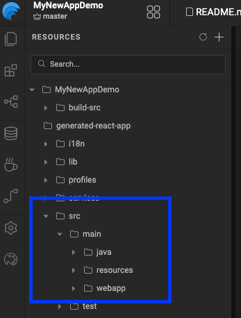

## Overview

When a user successfully logs in to a security-enabled WaveMaker application, three things happen in sequence: the default WaveMaker success handler runs first (handling CSRF token generation and session context), then any custom authentication success handlers execute, and finally the post-authentication redirection handler sends the user to their destination. This guide shows you how to plug into that pipeline — adding custom logic after login, attaching data to the user session, and optionally overriding the default redirect behavior.

---

## Prerequisites

- Security is enabled in your WaveMaker application
- Working knowledge of Java
- Familiarity with the Spring framework basics

---

## Create a Custom Authentication Success Handler

A custom success handler lets you run your own logic immediately after a user authenticates — for example, fetching the user's last login time from a database and storing it in the session.

### 1. Create the package structure

Under `src/main/java`, create a package for your security classes.

```
src/main/java/com/mycompany/myapp/security/
```



### 2. Implement `WMAuthenticationSuccessHandler`

Create a class that implements the `WMAuthenticationSuccessHandler` interface:

```java
package com.mycompany.myapp.security;

import com.wavemaker.runtime.security.handler.WMAuthenticationSuccessHandler;
import com.wavemaker.runtime.security.WMAuthentication;

public class MyCustomAuthenticationSuccessHandler
        implements WMAuthenticationSuccessHandler {

    @Autowired
    private UserInfoService userInfoService;

    @Override
    public void onAuthenticationSuccess(HttpServletRequest request,
                                        HttpServletResponse response,
                                        WMAuthentication authentication)
            throws IOException, ServletException {

        UsernamePasswordAuthenticationToken authenticationToken =
            (UsernamePasswordAuthenticationToken) authentication.getAuthenticationSource();

        String username = authenticationToken.getPrincipal();
        long lastAccessedTime = userInfoService.getById(username).getLastAccessedTime();

        // Visible to both frontend and backend
        authentication.addAttribute("lastAccessedTime", lastAccessedTime,
                Attribute.AttributeScope.ALL);

        // Visible only to the backend
        authentication.addAttribute("lastValidatedTime", System.currentTimeMillis(),
                Attribute.AttributeScope.SERVER_ONLY);
    }
}
```

### 3. Register the handler in `project-user-spring.xml`

Declare your class as a Spring bean:

```xml
<bean id="customAuthenticationSuccessHandler"
      class="com.mycompany.myapp.security.MyCustomAuthenticationSuccessHandler"/>
```

:::note
You can add multiple custom handlers by repeating steps 2 and 3 with different class names.
:::

---

## Control the Execution Order

By default, WaveMaker's built-in handlers execute at order `0`. Use the `@Order` annotation on your class to control when your handler runs relative to WaveMaker's:

```java
import org.springframework.core.annotation.Order;

@Order(-1) // runs before WaveMaker's default handler
public class MyCustomAuthenticationSuccessHandler
        implements WMAuthenticationSuccessHandler {
    // ...
}
```

| `@Order` value | Effect |
|---|---|
| Less than `0` | Your handler runs **before** WaveMaker's default handler |
| Greater than `0` | Your handler runs **after** WaveMaker's default handler |
| `0` (default) | Same level as WaveMaker's handler — avoid conflicts |

---

## Add Custom Attributes to the User Session

Use `authentication.addAttribute()` to attach any data to the authenticated user's session. Choose the right scope based on who needs to access it:

```java
authentication.addAttribute("key", value, Attribute.AttributeScope.ALL);
authentication.addAttribute("key", value, Attribute.AttributeScope.SERVER_ONLY);
```

| Scope | Accessible by |
|---|---|
| `ALL` | Both frontend (client) and backend (server) |
| `SERVER_ONLY` | Backend only — never exposed to the client |

:::tip
Use `SERVER_ONLY` for sensitive data like internal user IDs, tokens, or audit timestamps that the frontend has no business reading.
:::

---

## Override the Post-Authentication Redirect

By default, WaveMaker redirects users to a configured landing page after login. To replace that behavior with your own redirect logic, implement the `WMAuthenticationRedirectionHandler` interface:

```java
public interface WMAuthenticationRedirectionHandler {
    void onAuthenticationSuccess(HttpServletRequest request,
                                 HttpServletResponse response,
                                 WMAuthentication authentication)
            throws IOException, ServletException;
}
```

Then register it in `project-user-spring.xml` using this specific bean id:

```xml
<bean id="wmAuthenticationSuccessRedirectionHandler"
      class="com.mycompany.myapp.security.MyAuthenticationRedirectionHandler"/>
```

:::warning
The bean id `wmAuthenticationSuccessRedirectionHandler` is required exactly as shown. Using a different id will cause the custom handler to be ignored and WaveMaker will fall back to the default redirect.
:::

---

## Reference: `WMAuthentication` Class

`WMAuthentication` is the object passed into every handler. It wraps the underlying Spring `Authentication` and exposes session attributes and user info:

```java
public class WMAuthentication extends AbstractMutableAuthoritiesAuthenticationToken {

    public String getPrincipal()                        // returns the username
    public String getUserId()                           // returns the user ID
    public long getLoginTime()                          // epoch ms of login
    public Authentication getAuthenticationSource()     // original Spring Authentication object
    public Map<String, Attribute> getAttributes()       // all session attributes

    public void addAttribute(String key, Object value, Attribute.AttributeScope scope)
    public void setAuthorities(Collection<GrantedAuthority> authorities)
}
```

---

## Limitations and Constraints

| Constraint | Details |
|---|---|
| Works across all WaveMaker versions | No version restriction — this approach applies to all editions |
| One redirection handler only | Only one `wmAuthenticationSuccessRedirectionHandler` bean is supported. Multiple declarations will result in only the last one being used |
| Spring bean registration required | Handlers must be declared in `project-user-spring.xml` — annotation-based scanning alone is not sufficient |

---
