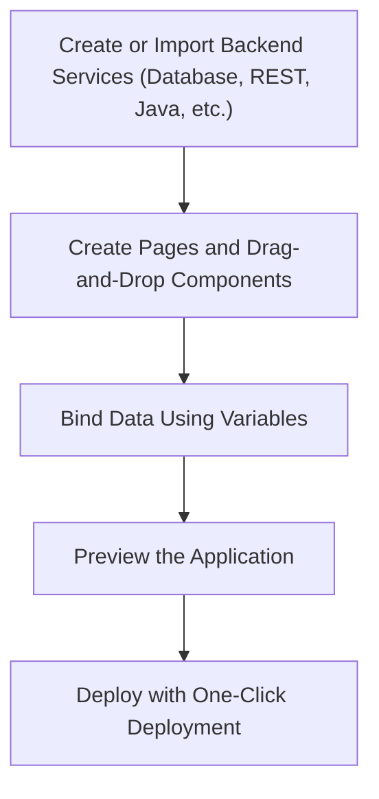

# Creating a Web App in WaveMaker

WaveMaker Studio is a low code platform that lets you rapidly build full stack web applications using visual development for UI and configuration driven backend services

A typical WaveMaker web app is generated as a single page application (SPA) using React or Angular for the frontend and Spring Boot + Hibernate for the backend. 

The platform provides responsive design out of the box and follows a clean three layer architecture:
  - **UI Layer:** The UI layer consists of pages constructed through drag and drop composition of components. Pages are divided into layout sections (header, content, footer, left panel) 
  - **Binding Layer:** The binding layer uses Variables as the integration mechanism between UI components and backend services.
  - **Backend Layer:** The backend layer is built on the Spring Framework ecosystem and provides service APIs for database access, REST/SOAP integration, and custom Java logic.

## WaveMaker Project Workspace
When you create a new application or open an existing one in WaveMaker Studio, you are taken to the Project Workspace.
The Project Workspace is the central area where you design UI, configure services, manage resources, and control project settings.

### Project Workspace Overview
The Project Workspace is divided into the following major sections:

#### Studio Left Navigation
The Left Nav provides access to all **Application resources and developer utilities**.

- **Resources**: Each resource opens its own Resource Explorer (as nested item in left nav).
  - Pages
  - Building Blocks
  - Page Structure
  - Databases
  - Java Services 
  - View Project and Team Published API's 
  - Settings
  - Style

- **Developer Utilities**
  - File Explorer – View project files
  - Logs – Application and server logs
  - App Resources
    - Update Sources
    - App.css
    - App.js
    - Issues

#### Studio Header
The Header provides access to all frequently used actions and global project operations.
  - Wavemaker Logo (Naviagtes back to projects)
  - Project name and Branching
  - Recently Accessed Items
  - Resource Toolbar 
    - Canvas
    - Canvas view switch (Markup, Script, Style)
    - Variables | Actions
    - Design Mode (Visual development)
    - AIRA (AI assisted development)
  - Project Configurations
    - Previewer
    - Sync Project Changes
      - Pull changes
      - Push changes
      - View Changes
      - Commit History
      - Push to external Repo
      - Open in VCS
    - Export Project
      - Export
        - Project Sources as ZIP
        - Project as Angular ZIP
        - Project as React ZIP
        - Project as WAR (Development | Deployment)
        - Theme to Team
      - Publish
        Publish to Teams as CORE
      - Deploy
    - Updates (Project Notifications)
    - User Profile
      - User Details 
      - Logout
      - About Studio

#### Studio Top Navigation
The Top Nav appears only when a page is selected and has below page operations.
  - WaveMaker Generated Pages
    - Duplicate
    - Ch ange Layout
  - User created Pages
    - Rename
    - Duplicate
    - Delete
    - Change Layout

#### Canvas (Design Area)
The Canvas occupies the majority of the workspace and is used to design and edit pages visually.
  - Displays the selected page UI
  - Allows drag-and-drop of components
  - Shows real-time layout and styling changes

#### Component Breadcrumb & Page Adjustments (Bottom of Canvas)
  - The Component Breadcrumb shows:
    - The hierarchy of the currently selected component
    - The active component context in Properties Panel
    - Quick navigation to parent containers
  - Page Adjustments (Sets zoom percentage of Page )

#### Properties Panel (Right Side)
The Properties Panel allows configuration of the selected page or component.
  - Properties – Data binding, behavior
  - Styles – Layout and appearance
  - Events – Client side logic
  - Device – Responsive behavior
  - Security – Role based access

---

### Step by Step Flow to Create a Web App

**Create or Import Backend Services**
  - Connect to a database
  - Import REST/SOAP APIs
  - Create custom Java services

**Create Pages**
  - Create pages, partials, and popovers
  - Define layout sections (header, content, footer, left panel)
  - Design navigation flow

**Drag and Drop Components**
  - Add tables, forms, charts, and UI controls
  - Configure properties visually
  - Add responsiveness

**Bind Data Using Variables**
  - Create Variables from services
  - Bind UI components to Variable data
  - Add lifecycle hooks (onBeforeUpdate, onSuccess, onError)
  - Write custom logic using Page/App scope

**Preview the Application**
  - Use built in preview mode
  - Test responsiveness
  - Validate data binding and navigation

**One Click Deployment**
  - Deploy to supported environments
  - Environment configurations managed via profiles

