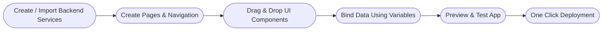

# Creating a Web App in WaveMaker

WaveMaker Studio is a development platform that helps you build full stack web apps quickly without writing everything from scratch. You design the UI visually, configure backend services, and the platform takes care of most of the heavy lifting, but you can still jump into code when you need to.

A WaveMaker web app is generated as a Single Page Application (SPA). The frontend is built using React or Angular, and the backend runs on Spring Boot with Hibernate handling persistence. Under the hood, WaveMaker auto generates REST APIs to connect the frontend and backend.

WaveMaker apps follow a simple three layer architecture:

  - **UI Layer** – Pages built using drag-and-drop widgets and layouts.
  - **Binding Layer** – Variables that connect the UI to backend data and services.
  - **Services Layer** – Backend services powered by Spring and Hibernate.

  ```mermaid
flowchart TB

  %% Remove subgraph background color
  classDef noBg fill:#ffffff,stroke:#333,stroke-width:1px;

  %% UI Layer
  subgraph UI["UI Layer"]
    WebUI["Web UI (Angular | React)"]
   
  end
  class UI noBg;

  %% Binding Layer
  subgraph Binding["Binding Layer"]
    VariablesSystem["Variables System"]

    DBVars["Database Variables DatabaseCRUDVariable DatabaseAPIVariable"]
    ServiceVars["Service Variables ServiceVariable WebSocketVariable"]
    ModelVars["Model Variables ModelVariable DeviceVariable"]
    Actions["Actions NavigationAction LoginAction NotificationAction"]
  end
  class Binding noBg;

  %% Backend Layer
  subgraph Backend["Backend Layer"]
    Spring["Spring Framework, Spring Boot, Spring Security"]

    ORM["Hibernate HikariCP"]
    BackendServices["Backend Services"]

    DBServices["Database Services, MySQL, PostgreSQL, MongoDB"]
    REST["REST APIs OpenAPI / Swagger Import"]
    SOAP["SOAP Services WSDL Import"]
    JavaServices["Java Services Custom Business Logic"]
  end
  class Backend noBg;

  %% Connections
  WebUI --> VariablesSystem
  
  VariablesSystem --> DBVars
  VariablesSystem --> ServiceVars
  VariablesSystem --> ModelVars
  VariablesSystem --> Actions

  DBVars --> Spring
  ServiceVars --> Spring
  Actions --> Spring

  Spring --> ORM
  Spring --> BackendServices

  ORM --> DBServices
  BackendServices --> DBServices
  BackendServices --> REST
  BackendServices --> SOAP
  BackendServices --> JavaServices
```

  Most development happens visually. You create pages, drop components like tables and forms, bind them to data using Variables (Database, Service, or Model), and wire up behavior using Actions and events. No manual API wiring is required, WaveMaker generates and manages REST endpoints automatically.

### Step-by-Step Flow to Create a Web App

This section explains the common development flow used to build web apps in WaveMaker Studio. The steps below reflect how most developers actually work—starting with backend setup, then moving to UI, data binding, testing, and deployment. You’ll likely loop between steps as you build and refine features.



**Create or Import Backend Services**

Start by setting up where your data and business logic will come from. This becomes the foundation for everything you bind on the UI.
  - Connect to a database and let WaveMaker generate entities and CRUD APIs.
  - Import external REST APIs (OpenAPI/Swagger) or SOAP services (WSDL) to consume existing systems.
  - Create custom Java services when you need backend logic that goes beyond simple CRUD.

  Once services are in place, you can immediately expose them to the UI using Variables without writing manual API clients.

**Create Pages**

Define the screens of your application and how users move between them.
  - Create pages for main screens, partials for reusable UI blocks, and popovers for modals/overlays.
  - Set up layout sections like header, content area, footer, and side panels.
  - Define navigation between pages (menus, buttons, links, routes).

This gives your app a basic structure before you start filling in real UI components and data.

**Drag and Drop Components**
  - Add components like tables, forms, inputs, buttons, and charts.
  - Configure component properties (labels, styles, visibility, actions) from the properties panel.
  - Adjust layout settings to make the UI responsive across screen sizes.

You can quickly build working screens without writing HTML/CSS, and tweak things visually as requirements change.

**Bind Data Using Variables**

  - Create Variables from database services, REST/SOAP services, or custom Java services.
  - Bind widget data fields directly to Variable responses.
  - Use lifecycle hooks like onBeforeUpdate, onSuccess, and onError to control behavior around service calls.
  - Add custom logic using Page or App scope scripts for validation, transformations, and conditional flows.

  Variables are the glue between your UI and backend. Most app behavior lives here.

**Preview and Test the Application**
  - Use the built-in preview mode to run the app.
  - Check how pages render on different screen sizes.
  - Validate that data loads correctly, forms submit properly, and navigation works end to end.

  Catching binding or layout issues early saves time later when features stack up.

**One Click Deployment**
  - Deploy to supported environments like Dev, QA, or Prod.
  - Use environment profiles to manage different configs (DB URLs, credentials, API endpoints).
  - Package the app as a WAR or Docker container if needed for your deployment pipeline.

  Deployment is mostly automated, so you can focus on building features instead of wiring infrastructure.

