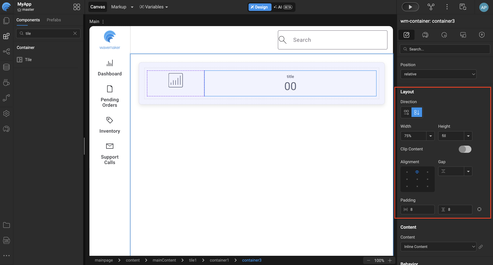
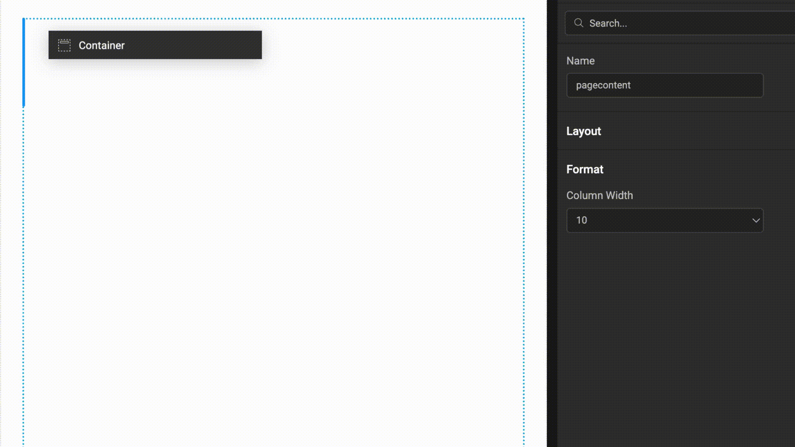
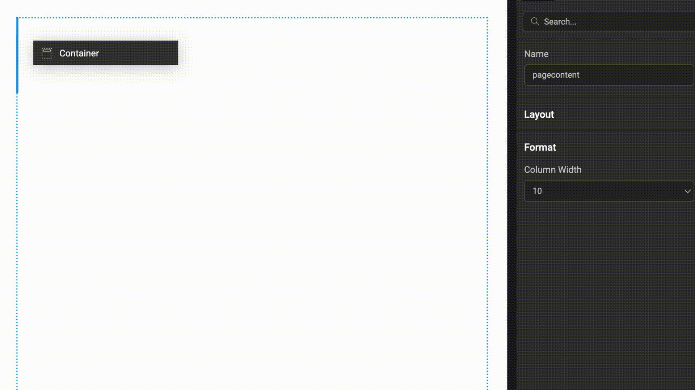
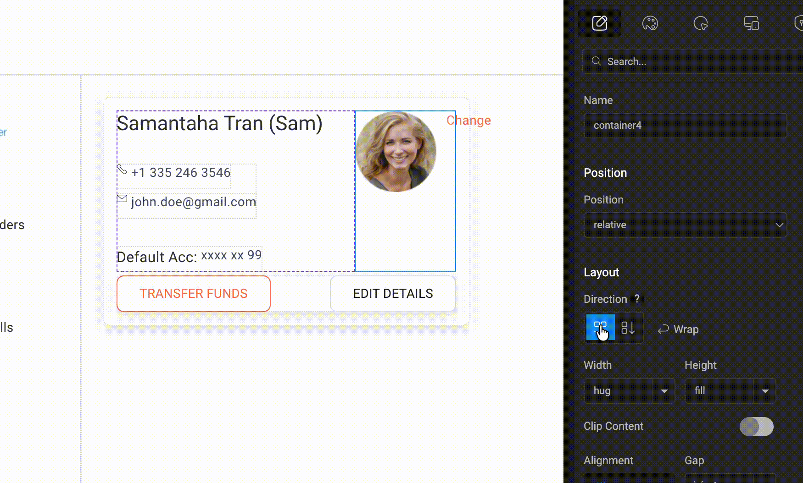
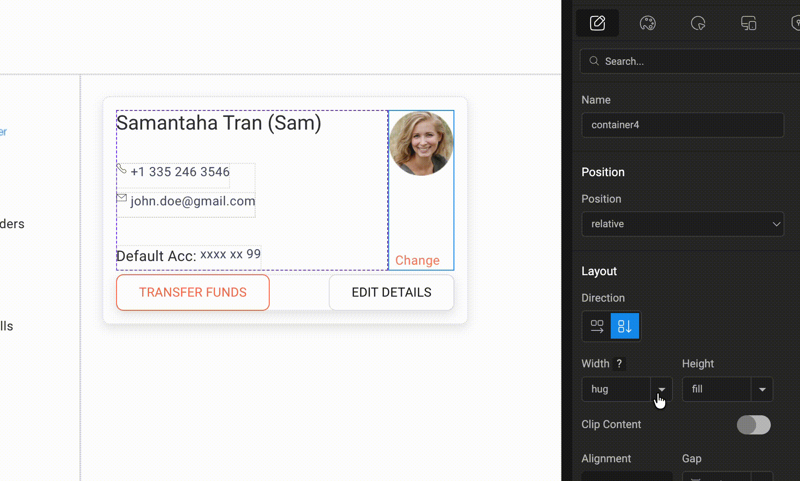
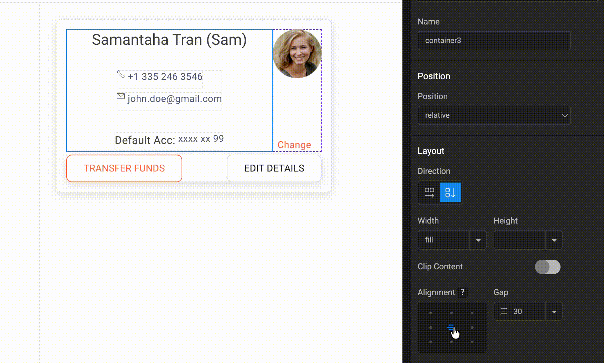
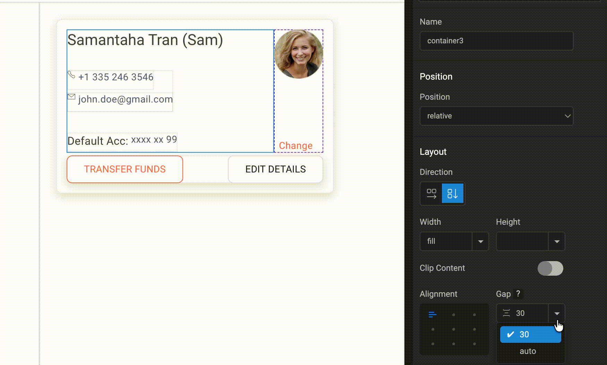
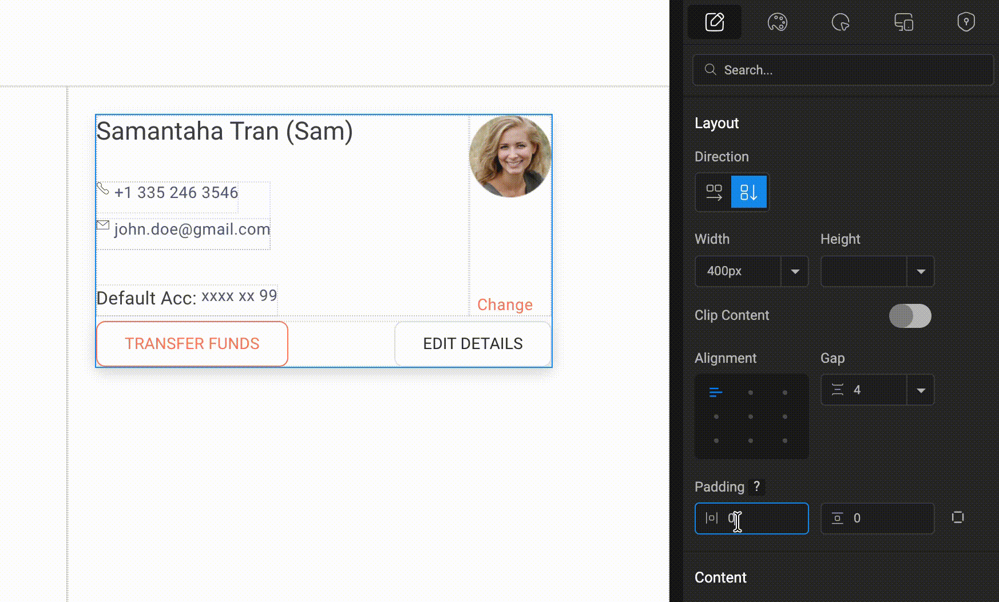

# Auto Layout

Auto Layout in WaveMaker is a layout system designed to manage component layouting and spacing without requiring direct CSS authoring. It provides developers with a visual layout workflow that closely aligns with the way designers typically create and reason about layouts. By abstracting common layout patterns into configurable properties within the editor, Auto Layout enables the creation of both simple and complex UI structures efficiently. It can be applied at both the page and section levels, ensuring consistent layout behavior across an application. The underlying layout model is loosely based on **CSS3 Flexbox** principles.

## Let us go into details.

This feature can be used in two approaches:

  

    1. **Component first approach**:

    <ol type="a">
      <li>Drop all your components onto the canvas without focusing on layout initially.</li>
      <li>Group what belongs together and multi-select siblings using Shift + click/tap.</li>
      <li>Right-click and choose “Add Auto Layout.”</li>
      <li>Fine-tune the layout settings inside the new Auto Layout container.</li>
    </ol>
  

  

    
  

  

    2. **Layout first approach**:

    <ol type="a">
      <li>Plan your layout structure in advance.</li>
      <li>Create layout containers based on your design.</li>
      <li>Add child components (e.g., anchors, labels, images) into the containers.</li>
      <li>Assemble your page or sections using these structured layouts.</li>
    </ol>
  

  

    
  

Auto layout is provided in the WaveMaker component called Container. As soon as we select a Container in the canvas and shift our focus to the properties panel on the right, we have a section called “Layout”.
Within Layout we have the following subsection with their respective configuration UI controls

### 1. Direction

  

    The Direction property in Auto Layout controls how components are arranged inside the container. By setting the direction to Row or Column, you can decide whether the elements appear side-by-side horizontally or stacked vertically. This helps in organising UI components efficiently and creating responsive layouts with minimal manual alignment.
  

  

    
  

### 2. Width

  

    The Width property determines how the container occupies space within its parent layout.When set to Fill, the container expands to take up all the available horizontal space.If set to Hug, the container adjusts its width based only on the size of its content, keeping the layout compact and neatly aligned.
  

  

    
  

### 3. Height

  

    The Height property controls how much vertical space the container occupies within its parent layout.When set to Fill, the container stretches to use the available vertical space.
    If set to Hug, the container automatically adjusts its height based on the size of its content, keeping the layout compact and well-structured.
  

  

    
  

### 4. Clip Content(If enabled it provides options for various types of scrolling)

- No Scrolling(default)
- Vertical
- Horizontal
- Both Directions

### 5. Alignment

  

    The Alignment property controls how the child components are positioned inside the container.It provides nine alignment options — Top Left, Top Center, Top Right, Middle Left, Middle Center, Middle Right, Bottom Left, Bottom Center, and Bottom Right.
    By default, the alignment is set to Top Left, but you can choose any option depending on how you want the content to be positioned within the container.
  

  

    
  

### 6. Gap(Accepts integer or Auto)

  

    The Gap property controls the spacing between the child components inside the container.
    You can enter a specific integer value to define the spacing, or set it to Auto to let the layout automatically manage the spacing between components.
  

  

    
  

### 7. Padding(Accepts horizontal/Vertical or individual padding)

  

    The Padding property controls the inner spacing between the container’s boundary and its content.You can set padding for Left-Right as horizontal padding and Top-Bottom as vertical padding to maintain consistent spacing inside the container.
  

  

    
  

For a complete understanding of how Auto Layout works in practice, watch the **Auto Layout video**, where the concepts and controls are demonstrated step by step.

<AcademyCard title="Auto Layout" academyLink="https://academy.wavemaker.ai/Walkthrough?wm=44FAE42ED5">
  <>
    

      <iframe
        style={{
width: "100%",
height: "100%",
position: "absolute",
left: 0,
top: 0,
borderRadius: 10
}}
        src="https://embed.app.guidde.com/playbooks/5o5iUfSnGjfTmySi58nwF8?mode=videoOnly"
        title="Auto Layout"
        frameBorder={0}
        referrerPolicy="unsafe-url"
        allowFullScreen="true"
        allow="clipboard-write"
        sandbox="allow-popups allow-popups-to-escape-sandbox allow-scripts allow-forms allow-same-origin allow-presentation"
      />
    

    

      
00:00: This video provides a comprehensive overview of Auto layout in wave maker.

      
00:04: We will explore its features approaches and controls to help you create efficient and consistent layouts.

      
00:12: Auto layout in wave maker is a system designed to manage component layout and spacing without requiring direct CSS authoring.

      
00:20: This feature provides developers with a visual layout workflow that closely aligns with how designers typically create and reason about layouts.

      
00:29: By abstracting Common layout patterns into configurable properties within the editor Auto layout enables the efficient creation of both simple and complex UI structures.

      
00:40: It can be applied at both the page and section levels ensuring consistent layout behavior across an application.

      
00:47: The underlying layout model is loosely based on css3 flexbox principles.

      
00:52: let's dive in

      
00:54: Auto layout offers two primary approaches the first is the component first approach where you bring components into the canvas, and then visually group and align them.

      
01:05: Multi-select sibling components right click and select add Auto layout to wrap them in an auto layout container then configure the layout.

      
01:14: The second approach is layout first which requires prior planning.

      
01:19: Create layout containers first then drop in child components like anchors labels and pictures to create your page or sections.

      
01:28: Auto layout is provided in the WaveMaker component called container.

      
01:33: Selecting a container in the canvas shifts Focus to the properties panel revealing the layout section with various UI controls.

      
01:42: The direction control dictates how child components are laid out within the container?

      
01:47: Selecting row Alliance components from left to right.

      
01:51: selecting column arranges them from top to bottom

      
01:54: the wrap toggle when enabled allows children to move to the next row or column if the container runs out of space

      
02:02: For the wrap property to function correctly. Make sure to define the relevant dimension such as width or height using a number or percentage.

      
02:10: The Width control determines the container’s horizontal size.

      
02:15: Fill stretches the container to occupy all available horizontal space.

      
02:20: Hug adjusts the width based on the content inside the container.

      
02:24: A custom number sets a fixed width.

      
02:28: The Height control works similarly to Width but affects the vertical dimension of the container, allowing you to control how much vertical space it occupies.

      
02:37: Fill stretches the container vertically to use available space.

      
02:41: Hug adjusts the height based on the content.

      
02:44: A custom number defines a fixed height.

      
02:48: The Clip Content toggle controls how overflowing content is handled.

      
02:52: When enabled, scrolling options become available if the content exceeds the container size.

      
02:59: You can choose horizontal scrolling, vertical scrolling, or both, depending on how the content overflows.

      
03:05: the alignment feature positions child components within the container

      
03:10: it uses a 3i 3 grid system to define placement.

      
03:14: This provides 9 alignment options such as top left top Center and bottom right?

      
03:22: The Gap feature controls the spacing between child components

      
03:26: when direction is set to Row the spacing is applied horizontally.

      
03:31: When direction is set to Column the spacing is applied vertically.

      
03:35: Gap values can be configured in two ways.

      
03:39: Auto child components expand to fill the available space

      
03:44: custom value

      
03:45: spacing is defined explicitly using units.

      
03:49: padding provides spacing around the content inside the container

      
03:53: You can set padding for left right and top bottom.

      
03:57: You can also assign padding independently for all four sides for finer control.

      
04:02: in summary Auto layout in wave maker offers a powerful and flexible system for managing component layouts

      
04:11: by understanding its approaches and controls developers can create efficient and consistent user interfaces.

    

  </>
</AcademyCard>
